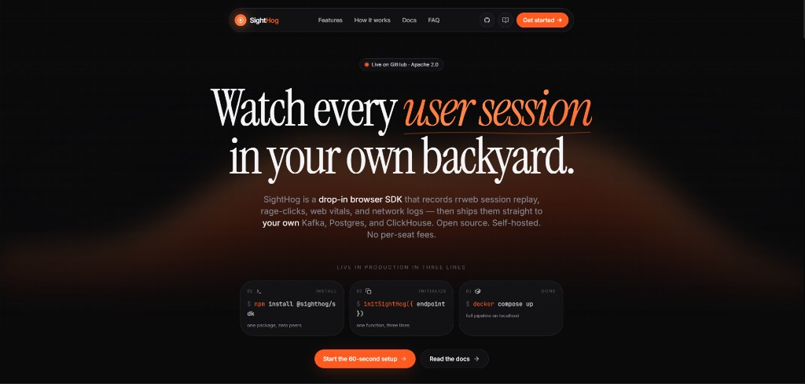

# SightHog

[](https://sight-hog.vercel.app/)

**Website:** [sight-hog.vercel.app](https://sight-hog.vercel.app/)  
**Documentation:** [sight-hog.vercel.app/docs](https://sight-hog.vercel.app/docs)

SightHog is a drop-in browser SDK that records rrweb session replay, rage-clicks, web vitals, and network logs — then ships them to your own Kafka, Postgres, and ClickHouse. Open source, self-hosted, no per-seat fees.

For setup guides, architecture docs, API reference, and privacy details, see **[sight-hog.vercel.app/docs](https://sight-hog.vercel.app/docs)**.

## Architecture

```
Browser (SDK on demo store)
        |
        v
  Ingest API (Go)  :8080
        |
        v
  Kafka (sighthog-raw-events)
        |
        +-- metadata worker --> PostgreSQL (sessions, users)
        +-- metrics worker  --> ClickHouse (events, interactions, telemetry)
        +-- blob worker     --> SeaweedFS (gzipped rrweb replays per session)
        |
        v
  Dashboard (Next.js)  :3000
```

### Data flow

1. The SDK batches rrweb events, interactions, and telemetry and POSTs to `/v1/events`. It sends a persistent `visitorId` (localStorage), `sessionId` (sessionStorage), `referrer`, and optional `userId`.
2. The ingest API validates payloads, resolves country (optional GeoLite2), parses browser/OS from User-Agent, masks sensitive fields, and publishes to Kafka.
3. Workers consume the same topic in parallel:
   - **Metadata** upserts one Postgres row per `sessionId` (updates `updated_at` on later batches).
   - **Metrics** writes ClickHouse rows for analytics charts and frustration detection.
   - **Blob** merges rrweb events per session and uploads `{sessionId}.json.gz` to object storage.
4. The dashboard reads Postgres for the session list, ClickHouse for charts, and SeaweedFS for replay files.

The demo store is a separate Next.js app on port 3001. It uses client-side routing across multiple pages while keeping one `sessionId` in `sessionStorage`, so you should see a single session row after browsing Home, Catalog, Product, Cart, and Checkout.

## Prerequisites

- Docker Desktop (recommended for full stack)
- Node.js 20+ (optional, for local app development)
- Go 1.22+ (optional, for ingest API development)

## Quick start (Docker)

Full install steps and SDK usage are in the **[docs](https://sight-hog.vercel.app/docs)**. To run the stack locally:

```bash
cp .env.example .env
docker compose up --build
```

| URL | Service |
|-----|---------|
| http://localhost:3000 | Dashboard (sessions and replay) |
| http://localhost:3000/analytics | Web analytics (visitors, geo, browsers) |
| http://localhost:3001 | Demo store (Next.js, multi-page) |
| http://localhost:8080 | Ingest API |
| http://localhost:9333 | SeaweedFS admin |

### Test the pipeline

1. Open http://localhost:3001 and click through several pages (use the nav: Home, Catalog, Product, Cart, Checkout).
2. On Home, try rapid clicks on the red “Broken checkout button” to generate rage-click events.
3. Wait about 30 seconds for workers to flush replay blobs.
4. Open http://localhost:3000, click **Refresh** on the session list, then **Watch** on your session.
5. Open **Analytics** in the nav (or http://localhost:3000/analytics) to see pageviews, unique visitors, world map, and browser/OS breakdowns.
6. Use **Clear all sessions** on the dashboard to wipe Postgres, ClickHouse, and stored replays before another test run.

### GeoIP (optional)

Country codes are resolved at ingest from the client IP using MaxMind GeoLite2:

1. Create a free MaxMind account and download `GeoLite2-Country.mmdb`.
2. Place it at `infra/geoip/GeoLite2-Country.mmdb` (this path is gitignored).
3. Restart the ingest API container. Without the file, `country` is stored as `Unknown` (or `LOCAL` for private IPs).

Existing Docker volumes need schema migrations:

```bash
docker compose exec clickhouse clickhouse-client --user default --password password --multiquery < infra/clickhouse/migrate_analytics.sql
docker compose exec postgres psql -U sighthog_user -d sighthog_metadata -f - < infra/postgres/migrate_analytics.sql
```

(Adjust paths if running from the host; pipe the SQL files into the containers.)

## Project layout

| Path | Role |
|------|------|
| `packages/sdk` | Browser SDK (rrweb, telemetry, funnel events, frustration detection) |
| `apps/demo` | Next.js demo store for generating traffic |
| `apps/dashboard` | Next.js control center and replay player |
| `services/ingest-api` | Go HTTP API and Kafka producer |
| `services/workers` | Kafka consumers (Postgres, ClickHouse, SeaweedFS) |
| `infra/` | Init scripts for Kafka, Postgres, ClickHouse, SeaweedFS |

## Local development (without rebuilding all containers)

Kafka and databases via Docker:

```bash
docker compose up kafka kafka-init postgres clickhouse seaweedfs seaweed-init
```

Ingest API:

```bash
cd services/ingest-api
go run ./cmd/server
```

Workers:

```bash
cd services/workers
go run ./cmd/processor
```

SDK:

```bash
cd packages/sdk
npm install && npm run build
```

Demo store:

```bash
cd apps/demo
npm install
npm run dev
```

Dashboard:

```bash
cd apps/dashboard
npm install
npm run dev
```

Set `NEXT_PUBLIC_SDK_ENDPOINT=http://localhost:8080/v1/events` for the demo app.

## Environment

Copy `.env.example` to `.env` before `docker compose up`. Important variables:

- `DATABASE_URL` — Postgres for session metadata
- `CLICKHOUSE_HTTP_URL` — analytics queries from the dashboard
- `SEAWEEDFS_ENDPOINT` / `SEAWEEDFS_BUCKET` — replay object storage
- `CORS_ALLOWED_ORIGINS` — must include demo and dashboard origins
- `NEXT_PUBLIC_DEMO_URL` — link from dashboard to the demo store
- `GEOLITE2_DB_PATH` — path to GeoLite2-Country.mmdb inside the ingest container (default `/geo/GeoLite2-Country.mmdb`)

## Verification commands

Postgres sessions:

```bash
docker compose exec postgres psql -U sighthog_user -d sighthog_metadata -c "SELECT id, initial_url, updated_at FROM sessions ORDER BY updated_at DESC LIMIT 10;"
```

ClickHouse event counts:

```bash
docker compose exec clickhouse clickhouse-client --user default --password password --query "SELECT event_name, count() FROM sighthog.events GROUP BY event_name;"
```

## License

Apache 2.0. See [LICENSE](LICENSE).
